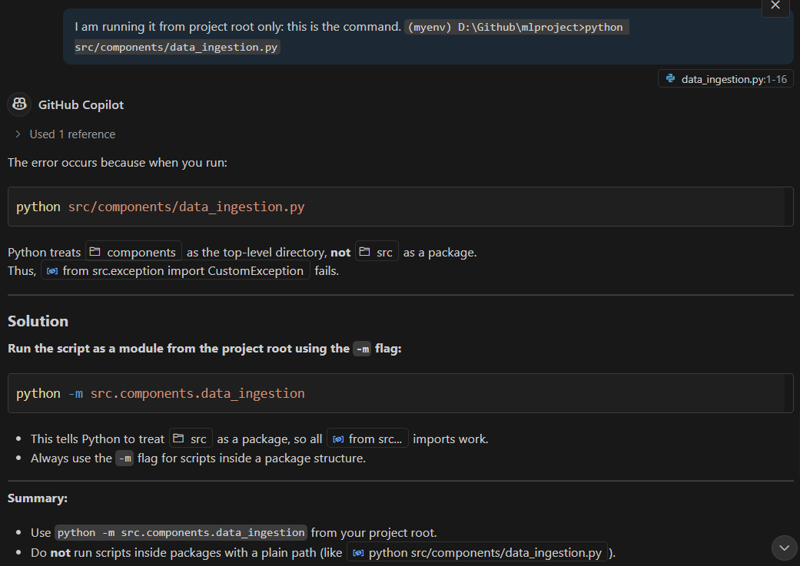
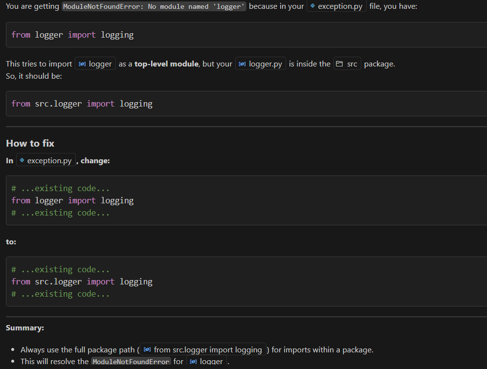

# Tutorial 4

## __data_ingestion.py__

- this is the script which imports the data from cloud or local.
- Will also import the custom exception and logging we created earlier from src folder.
- Will also import dataclasses
- Whenever we use this data ingestion components, there will be some inputs which will be required by the data ingestion components. Eg- training data path, test data path, save location, etc. These kinds of inputs will be created in another class known as data ingestion class - `DataIngestionConfig`.

- Reason why we are making `DataIngestionConfig` because in the data ingestion components any input which is required will be given by through this `DataIngestionConfig`.

- Using dataclass: Usually inside a class we used `__init__` to define a variable. If you use __dataclass__ you will be able to directly define your class variables.

### dataclass
The `@dataclass` decorator in Python is used to automatically generate special methods like `__init__`, `__repr__`, `__eq__`, and others for user-defined classes. It is part of the `dataclasses` module, introduced in Python 3.7.

```
from dataclasses import dataclass

@dataclass
class Point:
    x: int
    y: int
```

This is equivalent to writing:

```
class Point:
    def __init__(self, x: int, y: int):
        self.x = x
        self.y = y

    def __repr__(self):
        return f"Point(x={self.x}, y={self.y})"

    def __eq__(self, other):
        return isinstance(other, Point) and self.x == other.x and self.y == other.y
```

#### Key Features

- Automatic `__init__` method: You don’t need to write boilerplate initialization code.
- Optional immutability with `frozen=True`.
- Default values and `field()` customization.
- Type hints are required for each field.

#### Additional Options

```
from dataclasses import dataclass, field

@dataclass(order=True, frozen=True)
class Item:
    name: str
    price: float = field(default=0.0, compare=False)
```

- `order=True`: adds comparison methods like `__lt__`, `__le__`, etc.
- `frozen=True`: makes instances immutable (like namedtuples).
- `field()`: used for fine-grained control (e.g., default values, exclusion from comparison or repr, etc.).

Now back to the __data ingestion component__.

```
from dataclasses import dataclass

@dataclass
class DataIngestionConfig:
    """
    Data Ingestion Configuration Class
    """
    ### Paths for the dataset and train/test splits
    ### raw_data_path,train_data_path and test_data_path are defined as strings
    ### All the outputs of data ingestion will be stored in the 'artifacts' directory
    train_data_path: str = os.path.join('artifacts', 'train.csv')
    test_data_path: str = os.path.join('artifacts', 'test.csv')
    raw_data_path: str = os.path.join('artifacts', 'data.csv')
```

Now because of the above code the data ingestion component knows where to save the train data and test data. 

Now if you are only defining class variables, it would be better if you go ahead with `@dataclass` but if you have functions inside the class then its better to go ahead with the constructor functions `__init__`.


`DataIngestionConfig()` will consist of the three values: `train_data_path`, `test_data_path` and `raw_data_path`. And as soon as the class `DataIngestion` is called this line will get executed - `self.ingestion_config = DataIngestionConfig()` and the above 3 variables will be saved in this `ingestion_config`.

Now we will create our own function: `initiate_data_ingestion()`. This function ingest data from databases or any other location.

Now to add details about the database from which the data is being loaded say MongoDB or GCP BigQuery, you can create the client for it in `utils.py`. 

Now in the function we will put the steps in try and except to make sure that we are able to catch the errors. To get the location of the file __StudentsPerformance.csv__, right click on the file in the VS code directory in the exporer section and 
select __copy relative path__ from the dropdown.

Make sure you keep adding the logs so that you know after which line in the function the exception has happened.

Now in the earlier code we have already defined the path for training data, testing data and raw data. Now __artifacts__ is basically a folder, now lets create this folder.

```
# Create directories if they do not exist
os.makedirs(os.path.dirname(self.ingestion_config.train_data_path), exist_ok=True)
# Save the raw data to a CSV file
df.to_csv(self.ingestion_config.raw_data_path, index=False, header=True)
logging.info("Raw data saved to CSV")
```

`exist_ok = True` if that particular folder is already there it will be there only and will need not be deleted and a new folder will be created. We can also save the raw data in the path.

The function `initiate_data_ingestion` will return 3 parameters which will be used in the next step which is data transformation.

We can add `__init__` code now. Before running this check there is no artifact folder. 

Now open terminal and run this script. But make sure that you are in the environment __myenv__ created earlier.

Documenting some errors obtained and their fixes:

```
(myenv) D:\Github\mlproject>python src/data_ingestion.py

python: can't open file 'D:\\Github\\mlproject\\src\\data_ingestion.py': [Errno 2] No such file or directory
```
> It was fixed by adding the folder - components as I had missed it out.

Then got another error:

```
(myenv) D:\Github\mlproject>python src/components/data_ingestion.py

D:\Github\mlproject\src\components\data_ingestion.py:37: SyntaxWarning: invalid escape sequence '\d'  
  df = pd.read_csv('notebook\data\StudentsPerformance.csv')
Traceback (most recent call last):
  File "D:\Github\mlproject\src\components\data_ingestion.py", line 3, in <module>
    from src.exception import CustomException
ModuleNotFoundError: No module named 'src'

    from src.exception import CustomException
ModuleNotFoundError: No module named 'src'
```


```
(myenv) D:\Github\mlproject>python src/components/data_ingestion.py

D:\Github\mlproject\src\components\data_ingestion.py:37: SyntaxWarning: invalid escape sequence '\d'  
  df = pd.read_csv('notebook\data\StudentsPerformance.csv')
Traceback (most recent call last):
  File "D:\Github\mlproject\src\components\data_ingestion.py", line 3, in <module>
    from src.exception import CustomException
ModuleNotFoundError: No module named 'src'

    from src.exception import CustomException
ModuleNotFoundError: No module named 'src'
```

On chcking with copilot that - But I am running it from project root only: this is the command. `(myenv) D:\Github\mlproject>python src/components/data_ingestion.py`.



On correcting the code and running the code found another error:

```
(myenv) D:\Github\mlproject>python -m src.components.data_ingestion

Traceback (most recent call last):
  File "<frozen runpy>", line 198, in _run_module_as_main
  File "<frozen runpy>", line 88, in _run_code
  File "D:\Github\mlproject\src\components\data_ingestion.py", line 3, in <module>
    from src.exception import CustomException
  File "D:\Github\mlproject\src\exception.py", line 2, in <module>
    from logger import logging
ModuleNotFoundError: No module named 'logger'
```



Now after making the above changes the script runs perfectly and artifacts folder and log files get created.

```
(myenv) D:\Github\mlproject>python -m src.components.data_ingestion
Train Data Path: artifacts\train.csv
Test Data Path: artifacts\test.csv
Raw Data Path: artifacts\data.csv
```

##### why should we Always use the `-m` flag for scripts inside a package structure?

You should always use the -m flag for scripts inside a package structure because:

- __It tells Python to run the script as a module within its package.__
- This ensures that absolute imports (like `from src.exception import CustomException`) work correctly, since Python knows the package hierarchy.
- Without `-m`, Python treats the script as a standalone file, so it can’t resolve imports that use the package name (like src.logger or src.exception).
- Using `-m` sets up the sys.path so that the package root is included, preventing ModuleNotFoundError.

__In summary:__
The `-m` flag makes sure your code runs in the context of your package, so all imports work as intended. This is the standard and recommended way to run scripts that are part of a package.

***

Now in the `.gitignore` add `.artifacts` so that the files in it are not saved.

