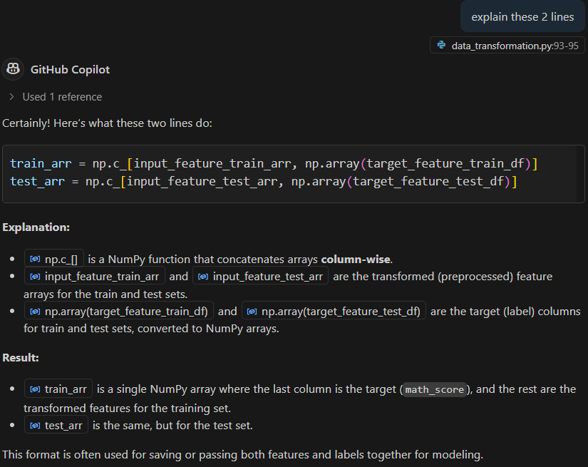

# Tutorial 5

## __data_transformation.py__

In this section we will do feature engineering, data cleaning, change or modify dataset columns or rows. 

```
from sklearn.compose import ColumnTransformer

```

`ColumnTransformer` is used to create a pipeline of transformations.

Now in the `data_ingestion.py` we had created a class `DataIngestionConfig`, this class provides all the input things for data ingestion component. 

```
@dataclass
class DataIngestionConfig:
    """
    Data Ingestion Configuration Class
    """
    ### Paths for the dataset and train/test splits
    ### raw_data_path,train_data_path and test_data_path are defined as strings
    ### All the outputs of data ingestion will be stored in the 'artifacts' directory
    train_data_path: str = os.path.join('artifacts', 'train.csv')
    test_data_path: str = os.path.join('artifacts', 'test.csv')
    raw_data_path: str = os.path.join('artifacts', 'data.csv')
```

Now similarly for `data_transformation.py` we will be creating a class `DataTransformationConfig`. This class will give any path or inputs which we require for data transformation.

Lets say we want to create a model and save as a pickle file.

```
class DataTransformationConfig:
    preprocessor_obj_file_path = os.path.join('artifacts', 'preprocessor.pkl')
```

The above is an example to show in `DataTransformationConfig` what exactly we want to give. So basically we want to give input to data transformation component.

The function `get_data_transformer_object()` in class `DataTransformation` is created to create all pickle files which will be responsible for converting the categorical feature to numerical, or other data transormation we have plans to do, etc.


Now once the function `get_data_transformer_object` is created we can start with creating ur another function for data transformation - `initiate_data_transformation`.




#### Uses of preprocessing_obj:

- __Transforms input data:__ It applies imputation, scaling, and encoding to the training and test data.
- __Ensures consistent preprocessing:__ The same transformations are applied to both train and test sets.
- __Can be saved and reused:__ It is saved as a pickle file (`preprocessor.pkl`) so you can use it later for inference or deployment.

##### Summary:
`preprocessing_obj` standardizes and encodes your features, making them ready for machine learning models.


Now we can save the preprocessor object as a pickle file using this function:

```
save_object(
                ### Function to save the preprocessor object in artifacts folder
                file_path=self.data_transformation_config.preprocessor_obj_file_path,
                ### the preprocessing_obj has the preprocessor object with pipelines for numerical and categorical features
                obj=preprocessing_obj
            )
```

Now if we go back to `utils.py`. It will have all the common things which we are trying to import or use. We could have created the `train_test_split()` here itself but to make the code cleaner, we have put it in a different script.

Using `dill` library:


Now once creating the `save_object()` in `utils.py` import it to `data_transformation.py`.

Now import the classes from `data_transformation.py` to `data_ingestion.py`.

```
from src.components.data_transformation import DataTransformationConfig
from src.components.data_transformation import DataTransformation
```

### Issues

> __what is issue in line 40? D:\Github\mlproject\src\components\data_ingestion.py:40: SyntaxWarning: invalid escape sequence '\d'?__

__Explanation:__

- In Python strings, the backslash \ is used as an escape character.
- `\d` is not a valid escape sequence, so Python gives a `SyntaxWarning: invalid escape sequence '\d'`.

Use this line of code instead:

```
df = pd.read_csv('notebook/data/StudentsPerformance.csv')
```

__Summary:__
Always avoid single backslashes in file paths in Python strings to prevent escape sequence issues.


